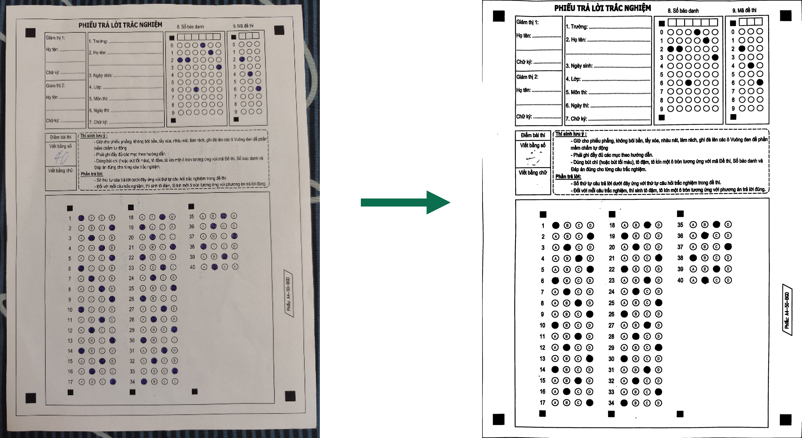
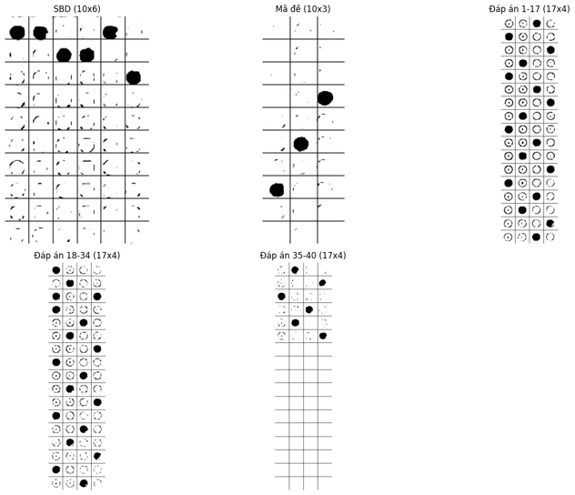
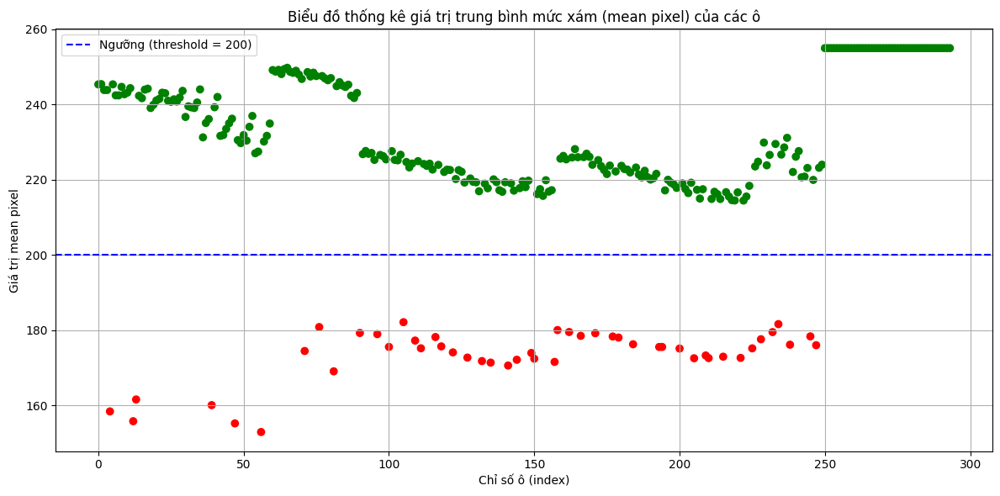
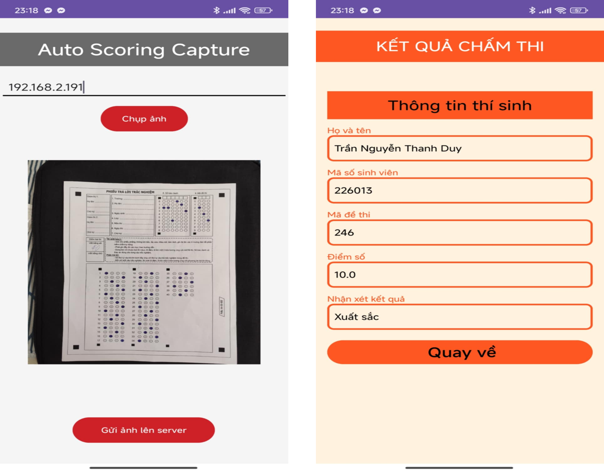

# Multiple_choice_grader

An automated multiple-choice grading system that receives an answer-sheet image, detects filled bubbles using image processing, calculates the score, stores results in CSV/JSON files, and uploads student results to Firebase Realtime Database.

The application includes:

- OpenCV-based answer-sheet preprocessing and bubble detection
- Student ID and exam-code recognition
- Automatic grading for 40 multiple-choice questions
- A Tkinter desktop interface
- A Flask image-upload server
- CSV and JSON result storage
- Firebase Realtime Database integration

## System Overview

The system processes an answer sheet through the following pipeline:

1. Receive an answer-sheet image from the client or use a local image.
2. Detect the paper boundary and correct its perspective.
3. Detect four reference markers on the answer sheet.
4. Crop the student ID, exam code, and answer regions.
5. Divide each region into individual bubble cells.
6. Calculate the average grayscale value inside each bubble.
7. Compare the value with a threshold to determine whether the bubble is filled.
8. Decode the student ID and exam code.
9. Compare the selected answers with the answer key.
10. Save and upload the grading result.

## Image Processing

The grading pipeline uses OpenCV to normalize the captured answer sheet before detecting selected answers.

Main preprocessing operations include:

- Grayscale conversion
- Gaussian blur
- Canny edge detection
- Contour detection
- Perspective transformation
- Brightness and contrast enhancement
- Morphological dilation
- Marker detection
- Region cropping
- Grid-based bubble analysis

### Paper Detection and Perspective Correction

The largest four-sided contour is treated as the answer sheet. The detected corners are sorted and transformed into a standard A4 image with a resolution of `2480 × 3508` pixels.



### Marker Detection and Region Extraction

Four black square markers are detected to align the inner answer-sheet area. The normalized image is then divided into:

- Student ID region: 10 rows × 6 columns
- Exam-code region: 10 rows × 3 columns
- Questions 1–17: 17 rows × 4 columns
- Questions 18–34: 17 rows × 4 columns
- Questions 35–40: extracted from the final answer block



### Bubble Selection Threshold

For each bubble, the program creates a circular mask and calculates the average grayscale pixel value inside that circle.

A bubble is considered filled when:

```text
mean grayscale value < 190
```

The threshold separates dark, filled bubbles from bright, unselected bubbles. It can be adjusted in `detect_filled_bubbles()` when lighting conditions, camera quality, or answer-sheet printing quality change.



## User Interface

The Tkinter interface allows the operator to:

- Select an `answers.json` answer-key file
- Enter the output CSV filename
- Start grading a local sample image
- View received-image notifications
- View grading logs and errors

At the same time, the application starts a Flask server on port `5000` to receive answer-sheet images from another device.



## Project Structure

```text
multiple-choice-grading-app/
├── GUI_ReceivePicture.py       # Tkinter GUI and Flask upload server
├── chamthi.py                  # Image processing and grading logic
├── firebase_helper.py          # Firebase Realtime Database integration
├── answers.json                # Answer keys grouped by exam code
├── serviceAccountKey.json      # Firebase Admin credentials, not committed
├── received_images/            # Images received through the Flask API
├── Result/                     # Individual recognition results in JSON format
├── CSV_Result/                 # Consolidated grading results
├── chamdiem1.png               # Image-processing illustration
├── chamdiem2.png               # Marker and region-detection illustration
├── chamdiem3.png               # Bubble-threshold plot
├── chamdiem4.png               # User-interface screenshot
└── README.md
```

## Main Files

### `chamthi.py`

This file performs the complete grading pipeline:

- Reads command-line arguments
- Detects and normalizes the answer sheet
- Locates four reference markers
- Crops the student ID, exam code, and answer regions
- Detects filled bubbles
- Generates `result3.json`
- Decodes the student ID and exam code
- Grades 40 questions
- Writes the result to CSV
- Stores an individual JSON result
- Uploads the score to Firebase

### `GUI_ReceivePicture.py`

This file provides both the desktop interface and image-upload API.

The Flask endpoint is:

```text
POST /upload
```

The uploaded image must use the multipart field name:

```text
image
```

After receiving the image, the server runs `chamthi.py` as a subprocess and returns the recognized student ID and grading output.

### `firebase_helper.py`

This module initializes Firebase Admin SDK and writes results to:

```text
SinhVien/{student_id}
```

Each record contains:

```json
{
  "ma_so": "student_id",
  "ma_de": "exam_code",
  "diem": 8.5,
  "nhan_xet": "Giỏi"
}
```

### `answers.json`

Answer keys are organized by exam code. Each exam code contains answers for questions `1` through `40`.

Example:

```json
{
  "753": {
    "answers": {
      "1": "c",
      "2": "a",
      "3": "d"
    }
  }
}
```

## Requirements

- Python 3.9 or later
- A camera or client device capable of sending an image through HTTP
- A Firebase project with Realtime Database enabled

Install the required Python packages:

```bash
pip install opencv-python numpy matplotlib flask werkzeug firebase-admin
```

Tkinter is normally included with Python on Windows. On Ubuntu or Debian, install it with:

```bash
sudo apt install python3-tk
```

## Firebase Configuration

1. Create a Firebase project.
2. Enable Realtime Database.
3. Open **Project settings → Service accounts**.
4. Generate a private key.
5. Save the downloaded credential file as:

```text
serviceAccountKey.json
```

6. Update the database URL in `firebase_helper.py` when using a different Firebase project.

Do not upload `serviceAccountKey.json` to GitHub.

Recommended `.gitignore` entries:

```gitignore
serviceAccountKey.json
__pycache__/
received_images/
Result/
CSV_Result/
last_sbd.txt
result3.json
de_thi_A4_scaled_preprocessing.jpg
```

## Running the Application

Place the Python files, `answers.json`, and Firebase credential file in the same project directory.

Start the desktop application and upload server:

```bash
python GUI_ReceivePicture.py
```

The Flask server starts at:

```text
http://0.0.0.0:5000
```

On another device in the same network, use the computer's local IP address instead of `0.0.0.0`, for example:

```text
http://192.168.1.10:5000/upload
```

In the GUI:

1. Select `answers.json`.
2. Enter a CSV filename, such as `grading_result.csv`.
3. Upload an answer-sheet image from the client device or run the local grading function.
4. Read the grading result in the output panel.

## Running the Grader Directly

The grading script can also run without the GUI:

```bash
python chamthi.py \
  --image received_images/sample.jpg \
  --answers answers.json \
  --output grading_result.csv
```

On Windows Command Prompt, run it on one line:

```cmd
python chamthi.py --image received_images/sample.jpg --answers answers.json --output grading_result.csv
```

## Upload API Example

Using `curl`:

```bash
curl -X POST \
  -F "image=@sample.jpg" \
  http://127.0.0.1:5000/upload
```

Example response:

```json
{
  "result": "Grading completed",
  "sbd": "123456"
}
```

## Output Files

### Consolidated CSV Result

The CSV file is stored in:

```text
CSV_Result/<output_filename>.csv
```

It contains:

- Sequence number
- Student ID
- Score
- Exam code
- Correct/incorrect result for each question
- Detection notes and errors

### Individual JSON Result

The detected bubble data for each student is stored in:

```text
Result/<student_id>.json
```

### Temporary Files

The current implementation also creates several intermediate files:

```text
de_thi_A4_scaled_preprocessing.jpg
result3.json
last_sbd.txt
```

## Error Handling

The system reports common answer-sheet problems, including:

- Missing student ID bubble
- Multiple bubbles selected in one student ID column
- Missing exam-code bubble
- Multiple exam-code bubbles selected
- No answer selected for a question
- Multiple answers selected for one question
- Unknown exam code
- Missing answer-key file
- Invalid or empty uploaded image
- Firebase upload failure

When the student ID cannot be decoded, the program creates a temporary identifier using the current timestamp:

```text
unknown_YYYYMMDDHHMMSS
```

## Important Configuration Values

The following values may need calibration for another answer-sheet template or camera setup:

```python
A4_WIDTH_PX = 2480
A4_HEIGHT_PX = 3508
threshold = 190
```

The fixed crop coordinates in `chamthi.py` are designed for the current answer-sheet layout. A different template requires updating the student ID, exam-code, and answer-region coordinates.

## Current Limitations

- The application depends on fixed crop coordinates.
- The image must clearly contain the complete answer sheet.
- Exactly four black reference markers must be detected.
- Lighting conditions can affect the bubble-selection threshold.
- The local GUI grading button currently expects `received_images/sample.jpg`.
- The current answer-processing function creates 17 rows for the final answer block even though only questions 35–40 are used.
- Firebase credentials and database URL are configured directly in the source code.

## Future Improvements

Possible improvements include:

- Displaying the uploaded answer-sheet image in the GUI
- Drawing detected answers directly on the image
- Allowing the operator to select a local image from the GUI
- Moving thresholds and crop coordinates to a configuration file
- Supporting multiple answer-sheet templates
- Adding automatic threshold calibration
- Replacing temporary files with in-memory processing
- Adding student-name lookup from Firebase
- Packaging the application with Docker or PyInstaller
- Adding authentication to the upload API
- Improving validation when four markers are not detected

## License

This project is intended for educational and research purposes. Add an appropriate open-source license before public distribution.
